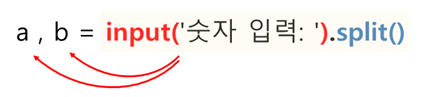

## **04 파이썬 입력**  

<br/>

### **input()**  

<br/><br/>

### **문자열(str) 입력하기**  
<br/>

```python
name = input('이름을 입력하세요: ')
print('이름:', name)
```

```
이름을 입력하세요: 이인환
이름: 이인환
```  

<br/>

```python
a = input('숫자: ')
print(a)    # str
```

```
숫자: 100
100
```  
<br/>


### ***타입을 출력해보기***   

<br/>

```python
a = input('이름: ')
print(a)
print(type(a))

b = input('숫자: ')
print(b)
print(type(b))
```

```
이름: 이인환
이인환
<class 'str'>

숫자: 100
100
<class 'str'>
```  

<br/><br/>


### **정수(int) 입력하기**

<br/>

```python
a = input('숫자: ')
a = int(a)

print('a:', a)
```

```
숫자: 100
a: 100
```  

<br/>


```python
a = int(input('숫자: '))
print(a)
```

```
숫자: 100
100
```  

<br/><br/>


### **실수(float) 입력하기**

<br/>

```python
a = input('실수: ')
a = float(a)

print(a)
```

```
실수: 1.2
1.2
```  

<br/>


```python
a = float(input('실수: '))
print(a)
```

```
실수: 1.2
1.2
```  

<br/><br/>


### **숫자 여러 개 입력받기**

<br/>

```python
a = int(input('a: '))
b = int(input('b: '))

print('a:', a)
print('b:', b)
```

```
a: 10
b: 20

a: 10
b: 20
```  

<br/><br/>

### **한 줄에 숫자 여러 개 입력받기**

<br/>

input()을 통해 한 줄에 여러 개의 숫자를 입력받으면 이 숫자들을 분리해야 합니다.  

2개의 값을 공백으로 구분하여 입력합니다.  
split()은 입력받은 값을 각각 변수 a, b에 str 형태로 대입합니다.  

<br/>

  

<br/>

변수 a, b에 저장된 데이터의 자료형은 str 입니다.  
따라서 정수 자료형으로 사용하기 위해서는  
int() 함수를 적용시켜 정수 자료형으로 변경해준 뒤 다시 변수 a, b에 차례대로 대입합니다.

<br/>

```python
a, b = input('숫자 입력: ').split()
a = int(a)
b = int(b)

print('a:', a)
print('b:', b)
``` 

```
숫자 입력: 10 20
a: 10
b: 20
```   
 

