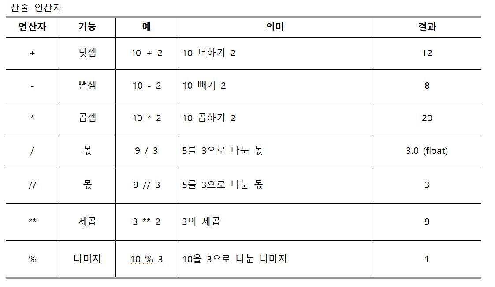
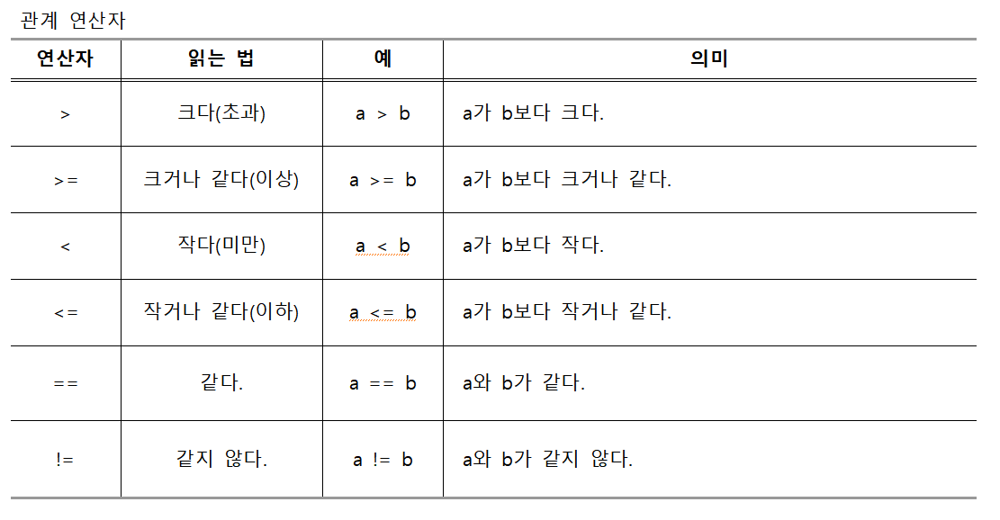
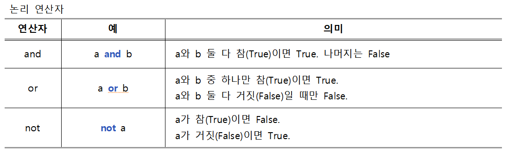

## **05 파이썬 연산자**  

<br/>


<br/>

파이썬에서 곱셈의 기호는 *이고,  
나눗셈의 몫을 구하는 기호는 / 와 //입니다.
<br/>

/ 는 소수 이하까지의 몫을 돌려주고,  
// 는 소수 이하를 모두 버린 몫을 돌려줍니다.
<br/>


<br/>

```python
a = 10
b = 3

print(a+b)  # 더하기
print(a-b)  # 빼기
print(a*b)  # 곱하기
print(a/b)  # 나누기(몫) 소수점
print(a//b) # 나누기(몫) 
print(a%b)  # 나머지
```

```
13
7
30
3.3333333333333335
3
1
```  

<br/> 

```python
a = 12345

print(a%10)
a = a//10

print(a%10)
a = a//10

print(a%10)
a = a//10

print(a%10)
a = a//10

print(a%10)
a = a//10
```


```
5
4
3
2
1
```  

<br/>


<br/><br/>



<br/>

```python
a = 10
b = 3

print(a > b)    # a가 b보다 크다. --> 맞는말 : True
print(a < b)    # a가 b보다 작다. --> 틀린말 : False

print(a >= b)   # a는 b보다 크거나 같다. --> True

print(a == b)   # a와 b는 같다.      --> False
print(a != b)   # a와 b는 같지 않다. --> True
```

```
True
False
True
False
True
```  

<br/><br/>



<br/>

```python
a = 10
b = 5
c = 0

print(a>9 and b==5)     
print(a>10 and b==5)
print(a>10 or b==5)
print(a>10 or b>5)
print(not a)
print(not c)
```

```
True
False
True
False
False
True

<br/><br/>
