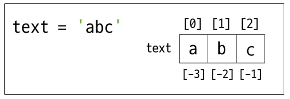
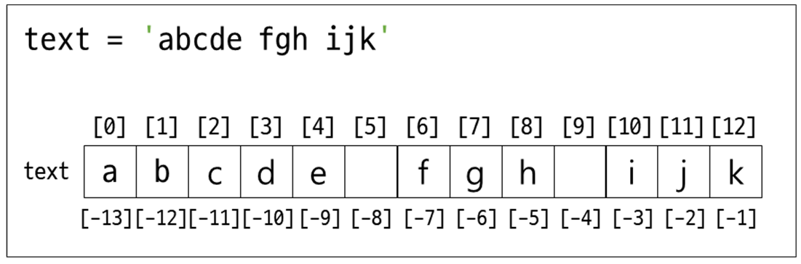

>## **str**

- 다른 언어와 달리 문자와 문자열을 따로 구분하지 않는다.
- ''(작은 따옴표) 또는 ""(큰 따옴표)에 감싸진다.
- 연산이 불가능 하다. (예외: 문자+문자, 문자*정수)
- 역 슬래쉬(\\) 뒤에 따옴표를 넣어서 출력할 수도 있다. 

<br/>


파이썬에서는 따옴표를 이용해서 문자열을 만듭니다.  
큰따옴표("") 또는 작은 따옴표('') 모두 사용 가능합니다.  

<br/>

***문자열 생성***  

```python
text1 = 'hello'         # 작은따옴표로 감싸서 적는다.
text2 = str('hello')    # str() 안에 적는다.
text3 = ''              # 빈 문자열을 만든다.
```   
<br/>

이렇게 생성된 문자열은 인덱스를 가집니다.  
가장 앞쪽에서부터 0번, 1번, 2번 등의 인덱스를 가집니다.  

<br/>


### **1. 문자열 인덱스**  

<br/>



<br/>

***양수 인덱스***

<br/>

양수 인덱스는 0부터 시작하여 1씩 증가하여 부여됩니다.
<br/>

인덱스를 사용하는 방법은 대괄호[]를 사용하여  
인덱스 번호를 적으면 해당 번호의 글자를 가지고 옵니다.
<br/>

예제와 같이 print() 함수를 사용하여  
text[0], text[1], text[2], text[3]을 차례대로 출력했을 때  
text에 들어있던 문자열 'abc'가 한 글자씩 출력됩니다.  

<br/>

```python
text = 'abc'

print(text[0])
print(text[1])
print(text[2])
```  

```
a
b
c
```  


<br/><br/>

***음수 인덱스***

<br/>

음수 인덱스는 마지막이 –1부터 시작합니다.
<br/>

문자열의 길이가 n이라면 –n부터 시작하여 1씩 증가하여 부여됩니다.
<br/>

예제와 같이 print() 함수를 사용하여  
text[-3], text[-2], text[-1]를 차례대로 출력했을 때  
text에 'c', 'b', 'a'가 하나씩 출력됩니다.  


<br />

```python
text = 'abc'

print(text[-3])
print(text[-2])
print(text[-1])
```  

```
text = 'abc'

print(text[-3])  # text[-3] = text[0]
print(text[-2])  # text[-2] = text[1]
print(text[-1])  # text[-1] = text[2]
```  
<br /><br/>


### **2. 문자열 슬라이스**  

<br/>

  

<br/>


```python
text = 'abcde fgh ijk'

print(text[2:5])    # cde
print(text[1:8])    # bcde fg
print(text[-5:-1])  # h ij
```   

```
cde
bcde fg
h ij
PS C
```   

<br/>


```python
text = 'abcde fgh ijk'

print(text[5:])    #  fgh ijk
print(text[:5])    # abcde
print(text[:])     # abcde fgh ijk
```

```
 fgh ijk
abcde
abcde fgh ijk
```   

<br/>

```python
text = 'abcde fgh ijk'

print(text[0:8:2])    #  acef
print(text[1:8:2])    #  bd g
```

```
acef
bd g
```   

<br/><br/>


### **3. 문자열 메소드**  

<br/>


#### ***3.1 출력 지정***

<br/>

***format() 메서드***  

```python
text = 'abcde {} {}'
print(text.format('ABC', 123))
```   

```
abcde ABC 123
```   
<br/>


#### ***3.2 대체 하기***  

<br/>

***replace(a, b)***    

```python
text = 'abcde ABC ABC'
print(text.replace('A', 'K'))
```   

```
abcde KBC KBC
```   

<br/>

```python
text = 'abcde ABC ABC'
print(text.replace('ABC', 'KKK'))
```   

```
abcde KKK KKK
```   

<br/>

#### ***3.3 자르기***  

<br/>

***split() 메서드***    


```python
text = 'abcde A/B/C A.B.C'
a,b,c = text.split()               # 공백을 기준으로 자른다.
print(a)
print(b)
print(c)
```   

```
abcde
A/B/C
A.B.C
```  

<br/>

```python
text = 'abcde A/B/C A.B.C'
a,b,c = text.split('.')              # .을 기준으로 자른다.
print(a)
print(b)
print(c)
```   

```
abcde A/B/C A
B
C
```  

<br/>


```python
text = 'abcde A/B/C A.B.C'
a,b,c = text.split('/')              # / 를 기준으로 자른다.
print(a)
print(b)
print(c)

```   

```
abcde A
B
C A.B.C
```  

<br/>


#### ***3.4 합치기***  

<br/>

***a.join()***


```python
text = 'abcde'         # abcde문자열 사이에 /를 추가
print('/'.join(text))
```  

```
a/b/c/d/e
```  

<br/>


#### ***3.5 개수 확인하기***  

<br/>

***count(a)***


```python
text = 'abcde ABC ABC'
print(text.count('a'))       # 소문자 a가 몇 개 있는가?
print(text.count('A'))       # 대문자 A가 몇 개 있는가?
print(text.count('1'))       # 숫자 문자 1이 몇 개 있는가?
```  

```
1
2
0
```  

<br/>

#### ***3.6 제거 하기***  

<br/>

***strip(a) / lstrip(a) / rstrip(a)***


```python
text = '  abcde  '
print(text.strip())     # 양쪽의 공백제거
print(text.lstrip())    # 왼쪽의 공백제거
print(text.rstrip())    # 오른쪽의 공백제거
```  

```
abcde
abcde  
  abcde
```  

<br/>


#### ***3.7 인덱스 찾기***  

<br/>

***find(a) / rfind(a) / index(a) / rindex(a)***  
***find() 메서드는 찾은 문자열이 없으면 –1을 반환하고, index() 메서드는 ValueError를 발생합니다.***  


```python
text = 'ABC ABC'
print(text.find('A'))   # 왼쪽에서 부터 해당 문자열의 인덱스를 가져온다
print(text.rfind('A'))  # 오른쪽에서 부터 해당 문자열의 인덱스를 가져온다
print(text.index('A'))  # 왼쪽에서 부터 해당 문자열의 인덱스를 가져온다
print(text.rindex('A')) # 오른쪽에서 부터 해당 문자열의 인덱스를 가져온다
```  

```
-1
4
0
4
``` 

<br/>


#### ***3.8 확인하기***  


- isalpha() / isdigit() / isalnum() / isupper() / islower()
- isalpha() : 알파벳으로 이루어졌는가?
- isdigit() : 숫자 문자열로만 이루어졌는가?
- isalnum() : 알파벳과 숫자 문자열로만 이루어졌는가?
- isupper() : 대문자로 이루어졌는가?
- islower() : 소문자로 이루어졌는가?

<br/>

***isalpha() / isdigit() / isalnum() / isupper() / islower() 메서드***  

```python
text1 = 'ABCabc123'
text2 = '123'
text3 = 'ABC'
text4 = 'abc'

print(text1.isalpha())     # 알파벳으로만 이루어졌는가
print(text1.isdigit())      # 숫자문자열로만 이루어졌는가
print(text1.isalnum())    # 알파벳과 숫자문자열로 이루어졌는가
print(text1.isupper())    # 대문자인가
print(text1.islower())    # 소문자인가

```   

```
False
False
True
False
False
```   

<br/>

#### ***3.9 대소문자 만들기***  

<br/>

***upper() / lower()***


```python
text = 'ABCabc'
print(text.upper())   # 문자열을 모두 대문자로 변경
print(text.lower())   # 문자열을 모두 소문자로 변경
```  

```
ABCABC
abcabc
```  

<br/>


#### ***3.10 채우기***  

<br/>

```python
y='2020'
m='3'
d='1'

print(y.zfill(4))
print(m.zfill(2))
print(d.zfill(2))
```  

```
2020
03
01
```  

<br/>
