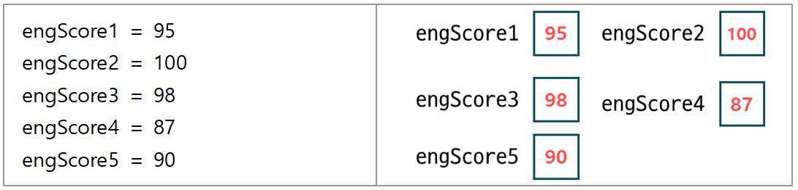
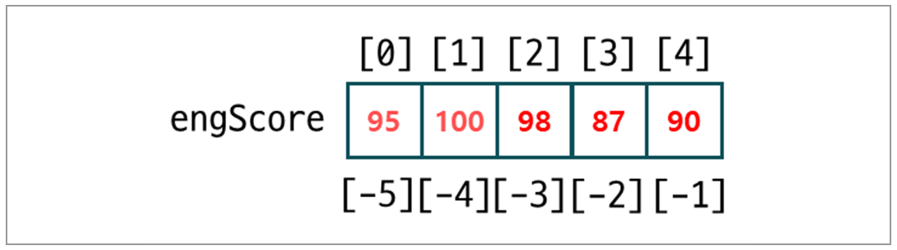
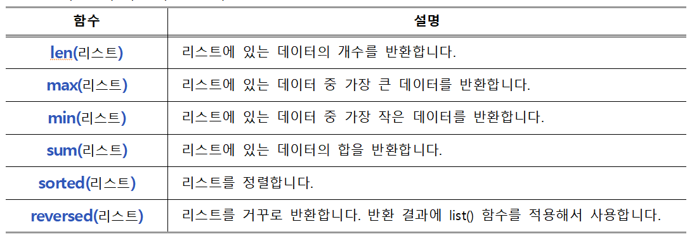

>## **list**

<br/>

5명의 학생의 영어점수를 저장하기 위해서는  
변수를 5개 만들어서 점수를 저장해야 합니다.
<br/>




<br/>

하지만 학생이 10명, 100명처럼 많아지게 되면 변수를 10개, 100개 만들기에는 불편한 것 같습니다.  
<br>

이런 경우에는 리스트를 사용하면 편리합니다.  
리스트는 여러 개의 데이터를 모아 놓고 처리할 수 있는 자료형입니다.
<br/>

다음과 같이 5명의 점수를 [ ] (대괄호)를 사용해서 묶고 ',' (쉼표)로 구분해서 리스트를 만듭니다.  

<br/>

## **리스트**

```python
scoreList = [95, 100, 98, 87, 90]
```  

<br/>

### **1. 빈 리스트 만들기**  
 
<br/>

<br/>

```python
aList = []
bList = list()

print(aList)
print(bList)
```  

```
[]
[]
``` 

<br/></br>


### **2. 데이터가 있는 리스트 만들기**  
 
<br/>

데이터가 있는 리스트 또한 대괄호를 사용하거나  
list() 함수를 사용하는 방법이 있습니다. 

<br/>

***[ ] 대괄호 사용***  

```python
aList = [10, 20, 30, 40, 50]
```  
 
<br/>


***list() 함수 사용***  

```python
bList = list('abc')
```  

<br/>

***데이터가 있는 리스트 만들기***

```python
aList = [10, 20, 30, 40, 50]
bList = list('abc')

print(aList)
print(bList)
``` 

```
[10, 20, 30, 40, 50]
['a', 'b', 'c']
```  

<br/><br/>

### **3. 리스트 인덱스**  

<br/>
리스트 역시 앞서 배운 문자열처럼 인덱스가 있습니다.  
<br/>


<br/>
따라서 리스트 역시 문자열처럼 인덱스를 사용해서 데이터에 접근할 수 있습니다.  
<br/><br/>

***인덱스를 사용해서 접근하기*** 

```python
engScore[0]     # 95
engScore[1]     # 100
engScore[-1]    # 90
engScore[-2]    # 87 
```  

<br/>

***슬라이스를 사용해서 접근하기*** 

```python
engScore[0:5:1]     # [95, 100, 98, 87, 90]
engScore[1:4:1]     # [100, 98, 87]
engScore[4:1:-1]    # [90, 87, 98] 
```

<br/>


***리스트 인덱스와 슬라이스***  

```python
aList = [10, 1.23, 'apple', 100, 'banana', 'blue']

print(aList[0])
print(aList[-1])
print(aList[0:6:1])
print(aList[1:5:1])
print(aList[5:2:-1])
```  

```
10
blue
[10, 1.23, 'apple', 100, 'banana', 'blue']
[1.23, 'apple', 100, 'banana']
['blue', 'banana', 100]
```  

<br/><br>


### **4. 리스트에 함수 사용하기**  
 
<br/>



<br/>

***리스트에 len(), max(), min(), sum() 함수를 사용***

```python
aList = [20, 10, 30, 90, 80, 70, 60, 100, 50, 40]

print('데이터의 개수:', len(aList))
print('가장 큰 데이터:', max(aList))
print('가장 작은 데이터:', min(aList))
print('합:', sum(aList))
```  

```
데이터의 개수: 10
가장 큰 데이터: 100
가장 작은 데이터: 10
합: 550
```  

<br/>

sorted() 함수는 리스트를 오름차순으로 정렬해서 결과를 리스트로 반환합니다.    
이때 원본 리스트는 변경되지 않습니다.
<br/>

sorted() 함수에 두 번째 인자로 reverse=True를 넣으면 내림차순으로 정렬합니다.  

<br/>


***리스트에 sorted() 함수 사용하기***  
```python
aList = [20, 10, 30, 90, 80, 70, 60, 100, 50, 40]
bList = sorted(aList)
cList = sorted(aList, reverse=True)

print('aList:', aList)
print('bList:', bList)
print('cList:', cList)
``` 

```
aList: [20, 10, 30, 90, 80, 70, 60, 100, 50, 40]
bList: [10, 20, 30, 40, 50, 60, 70, 80, 90, 100]
cList: [100, 90, 80, 70, 60, 50, 40, 30, 20, 10]
``` 

<br/>


### **5. 리스트 메소드**  
<br/> 

앞서 문자열을 공부할 때 문자열에서만 사용할 수 있는 함수가 있었습니다.  
리스트 역시 리스트에서만 사용할 수 있는 리스트 메소드가 있습니다.  

<br/>


***위치 찾기***  

index() 메소드는 인자로 넣은 데이터의 인덱스를 반환합니다.  

<br/>

```python
aList = ['a', 'b', 'c', 'd', 'e']
aList.index('c')  # 리스트에서 'c'의 위치 찾기
``` 


index() 메소드의 예입니다.  
리스트에 찾을 데이터를 인자로 넣습니다.  
데이터가 있으면 데이터의 인덱스를 반환하고 없으면 'ValueError'가 발생합니다.  

```python
aList = [20, 10, 30, 10, 50]

# 데이터 10이 가장 먼저 나오는 인덱스 반환
print(aList.index(10)) 
``` 

```
1
```  

<br/>


***추가하기***  


append() 메소드는 데이터를 리스트의 맨 끝에 추가하는 메소드입니다.

<br/>

```python
aList = ['a', 'b', 'c']
aList.append('d')           # 리스트의 맨 끝에 데이터 'd'를 추가
```  

<br/>

insert() 메소드는 데이터를 원하는 위치에 넣는 메소드입니다.


```python
aList = ['a', 'b', 'c']

# 인덱스1에 데이터 'd'를 넣는다. 나머지 데이터는 뒤로 밀림
aList.insert(1, 'd')          
```

<br/>

데이터를 추가하는 메소드의 예제입니다.  
append() 메소드는 리스트의 맨 끝에 데이터를 추가합니다.  

```python
aList = [20, 10, 30]
aList.append(40)
aList.append(50)

print(aList)               
```  

```
[20, 10, 30, 40, 50]
```  

<br/>   

insert() 메소드는 원하는 위치에 데이터를 추가합니다.  

```python
aList = [20, 10, 30, 40, 50]
aList.insert(2, 100)

print(aList)               
```  

```
[20, 10, 100, 30, 40, 50]
```  

<br/>

***삭제하기***  


remove() 메소드는 인자로 넣은 데이터를 리스트에서 삭제합니다.  

<br/>

```python
aList = ['a', 'b', 'c', 'd', 'e']

 # 리스트에서 데이터 'c'를 삭제
aList.remove('c')                
``` 

<br/>

emove() 메소드의 예제입니다.  
데이터 20을 리스트에서 삭제합니다.  

```python
aList = [10, 20, 30, 40, 50]
aList.remove(20)           

print(aList)
```  

```
[10, 30, 40, 50]
```  

<br/>

del 연산자를 사용해서 리스트의 인덱스 1번에 있는  
데이터 20을 삭제할 수도 있습니다.  


```python
aList = [10, 20, 30, 40, 50]
del aList[1]          

print(aList)
```  

```
[10, 30, 40, 50]
```  

<br/>

***특정 항목의 개수***  


count() 메소드는 리스트에 있는 특정 데이터의 개수를 반환합니다.  

<br/>


```python
aList = ['a', 'b', 'c', 'd', 'e', 'c', 'c']

# 리스트에서 데이터 'c'의 개수
aList.count('c')                 
```  

<br/>

리스트에서 20의 개수를 세는 예제입니다.  

```python
aList = [10, 20, 20, 30, 20, 40, 50]         

print(aList.count(20))              
```  

```
3
```

<br/>

***정렬하기***  


sort() 메소드는 리스트를 정렬하는 메소드입니다.  
sorted() 함수와는 달리 리스트 자체를 내부적으로 정렬합니다.  
따라서 원본 리스트가 변경됩니다. 

<br/>

```python
aList = [20, 10, 30, 40, 50]
aList.sort( )                 
``` 

<br/>

sort() 메소드를 사용해서 리스트를 정렬하는 예제입니다.  

```python
aList = ['a', 'd' ,'e', 'c', 'b']         
bList = [20, 10, 30, 50, 40]

aList.sort()
bList.sort()

print(aList)
print(bList)
```  

```
['a', 'b', 'c', 'd', 'e']
[10, 20, 30, 40, 50]
```  

<br/>
