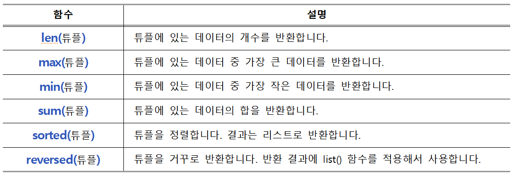

>## **tuple**

<br/>

튜플은 리스트와 같이 여러 데이터를 묶어서 하나의 튜플 객체로 관리할 수 있습니다.  
하지만 튜플은 일단 만들고 나면 그 안에 있는 데이터를 변경할 수 없습니다.  

<br/>

### **1. 빈 튜플 만들기**  

<br/>

비어있는 튜플은 만드는 방법은 괄호를 사용하거나 tuple() 함수를 사용하는 방법이 있습니다. 
<br/>


***( ) 괄호 사용***  
```python
scoreTuple = ()
```

<br/>

***tuple() 함수 사용***  
```python
scoreTuple = tuple()
```

<br/>


***빈 튜플 만들기***  
```python
scoreTuple1 = ()
scoreTuple2 = tuple()

print(scoreTuple1, type(scoreTuple1) )
print(scoreTuple2, type(scoreTuple2) )
```

```
() <class 'tuple'>
() <class 'tuple'>
```
<br/><br/>


### **2. 데이터가 있는 튜플 만들기**  

데이터가 있는 튜플 또한 괄호를 사용하거나 tuple() 함수를 사용하는 방법이 있습니다.  
<br/>

***( ) 괄호 사용***  
```python
aTuple = (10, 20, 30, 40, 50)
```

<br/>

***tuple() 함수 사용***  
```python
aTuple = tuple('abc')
```

<br/>


데이터가 1개인 튜플을 만들 때는 데이터 1개를 적고 쉼표를 적어야 합니다.  

***데이터가 1개인 튜플*** 
```python
aTuple = (10)

# 데이터 옆에 쉼표를 적는다.
bTuple = (10,)                     

print(aTuple, type(aTuple) )   
print(bTuple, type(bTuple) )
```  

```
10 <class 'int'>       # 튜플 아님
(10,) <class 'tuple'>  # 튜플
```  

<br/>


데이터가 여러 개인 튜플을 만들 때는 괄호 안에 데이터를 쉼표로 구분해서 적습니다.  

***데이터가 여러 개인 튜플 만들기*** 
```python
aTuple = (10, 20, 30)
bTuple = ('a', 'b', 'c')

print(aTuple)
print(bTuple)
```  

```
(10, 20, 30)
('a', 'b', 'c')
``` 

<br/><br/>


### **3. 튜플 인덱스**  

<br/>

튜플 역시 앞서 배운 리스트와 똑같은 방법으로 인덱스를 사용해서 데이터에 접근할 수 있습니다.

<br/>


***튜플의 인덱스와 슬라이스***  
```python
aTuple = (10, 20, 30, 'apple', 1.23, 30, 40, 50)

print(aTuple[2])
print(aTuple[3])
print(aTuple[2:6:1])
```  

```
30
apple
(30, 'apple', 1.23, 30)
```  

<br/>

튜플은 변경 불가능한 자료형입니다.  
튜플은 한 번 만들고 나면 데이터를 수정, 추가, 삭제할 수 없습니다.  

다음과 같이 튜플의 데이터를 수정하려고 하면 에러를 발생합니다.  

<br/>

***튜플의 수정***  
```python
aTuple = (10, 20, 30)
aTuple[0] = 100  # 에러 발생
```  

```
aTuple[0] = 100
TypeError: 'tuple' object does not support item assignment
```  

<br/>

***튜플의 삭제***  
```python
aTuple = (10, 20, 30)
del aTuple[0]  # 에러 발생
```  

```
del aTuple[0]
TypeError: 'tuple' object doesn't support item deletion
```  
<br/>


### **4. 튜플에 함수 적용하기**  

  

<br/>


***튜플에 len(), max(), min(), sum() 함수를 사용***  

```python
aTuple = (20, 10, 30, 90, 80, 70, 60, 100, 50, 40)

print('데이터의 개수:', len(aTuple))
print('가장 큰 데이터:', max(aTuple))
print('가장 작은 데이터:', min(aTuple))
print('합:', sum(aTuple))
```

```
데이터의 개수: 10
가장 큰 데이터: 100
가장 작은 데이터: 10
합: 550
```  

<br/>


### **5. 튜플 메소드**  

<br/>

튜플에서만 사용할 수 있는 함수가 있습니다.  

<br/>


***(1) 개수 세기***  

count() 메소드는 인자로 넣은 데이터의 개수를 반환합니다.  

<br/><br/>


***count() 메소드***
```python
aTuple = (2, 1, 3, 2, 2, 2, 4, 5, 2)

# 튜플에서 2의 개수
print(aTuple.count(2))
```  

```
5
```  

<br/>

***(2) 위치 찾기***  

index() 메소드는 인자로 넣은 데이터의 인덱스를 반환합니다.  

<br/>

***index() 메소드***
```python
aTuple= ('a', 'b', 'c', 'd', 'e')
print(aTuple.index('c'))
```  

```
2
```  
