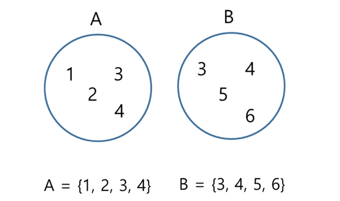
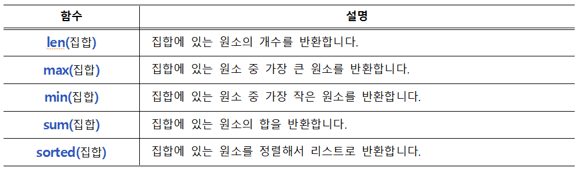

layout: single
title:  "07 set"
---

>## **set**

<br/>

수학 시간에 배운 집합(set)을 다룰 수 있는 자료형인 set을 살펴보겠습니다.
<br/>

set은 다음과 같이 표현할 수 있고 set을 만들때는 { }를 사용합니다.
<br/>


  

<br/>

### **set의 특징**   

- {} 중괄호로 값을 구분.
- 순서대로 저장되지 않는다.
  - ```python aSet = {2, 4, 6, 8}```  
  ```{8, 2, 4, 6}```    

- 중복된 값은 한번 만 저장.
  - ```python bSet = {2, 4, 6, 4,3, 5}```  
  ```{2, 3, 4, 5, 6}```  

<br/><br/>


### **1. 빈 set 만들기**  
<br/>

빈 집합을 만들 때는 set() 함수를 사용합니다.
<br/>

|**set() 함수 사용**|
|:--:|
|emptySet = {}|  


<br/>


***빈 집합 만들기***  

```python
emptySet = set()
print(emptySet)
print(type(emptySet))
```  

```
set()
<class 'set'>
```  

<br/><br/>


### **2. 데이터가 있는 set 만들기**  
<br/>

데이터가 있는 집합은 { }를 사용하거나,  
set() 함수를 사용해서 만들 수 있습니다.  
 
|**{ } 중괄호 사용**|
|:--:|
|aSet = {10, 20, 30, 40, 50}|  

<br/>

|**set() 함수 사용**|
|:--:|
|aSet = set([1, 2, 3, 4, 5])|  

<br/>


***데이터가 있는 집합 만들기***  

```python
aSet = {10, 20, 30, 40, 50}
bSet = set([10, 20, 30])

print(aSet)
print(bSet)
```  

```
{50, 20, 40, 10, 30}
{10, 20, 30}
```  

<br/><br/>


### **3. set의 특징**  

<br/>

set은 다음과 같은 특징이 있습니다.  

**(1) 순서 개념이 없다.**  

set은 순서 개념이 없습니다.  
따라서 리스트나 튜플과 같이 인덱스를 사용할 수 없습니다.  
<br/>

|**인덱스 사용 못 함**|
|--|
|aSet = {1, 3, 5, 4, 2}<br>print(aSet[1])  # TypeError|  

<br/>

**(2) 중복을 허용하지 않는다.**  

집합은 중복을 허용하지 않아서 같은 데이터를 넣어도 하나로 취급합니다.	
<br/>

|**중복을 허용하지 않음**|
|--|
|aSet = {1, 2, 2, 3, 5, 4, 4, 3, 2}<br>print(aSet)  # {1, 2, 3, 4, 5}|


### **4. set에 함수 적용하기**  

<br/>

set에는 다음의 내장함수를 적용할 수 있습니다.  


<br/>


***set에 내장함수 사용하기 1***  

```python
aSet = {10, 20, 30, 40, 50}

print(len(aSet))
print(max(aSet))
print(min(aSet))
print(sum(aSet))
```  

```
5
50
10
150
```  

<br/>

***set에 내장함수 사용하기 2*** 

```python
aSet = {10, 20, 30, 40, 50}

aList = sorted(aSet)
print(aList)

bList = sorted(aSet, reverse=True)
print(bList)
```  

```
[10, 20, 30, 40, 50]
[50, 40, 30, 20, 10]
```  

<br/><br/>


### **5. set 메소드**  

<br/>

문자열, 리스트, 튜플 메소드와 같이 set 에서만 사용 가능한 메소드가 있습니다.  

<br/>

**(1) 데이터 추가하기**  

add() 메소드는 인자로 넣은 데이터를 집합의 원소로 추가합니다.  

<br/>

|**add() 메소드**|
|--|
|s = {2, 1, 3, 4, 5}<br/>s.add(6)   # 6을 원소로 추가| 


***add() 메소드***  

```python
s = {2, 1, 3, 4}
s.add(5)
print(s)
```  

```
{1, 2, 3, 4, 5}
```  

<br/>


**(2) 모든 원소 지우기**  

clear() 메소드는 집합의 원소를 모두 지웁니다.  
따라서 공 집합으로 만듭니다.  

|**clear() 메소드**|
|--|
|s = {2, 1, 3, 4, 5}<br/>s.clear()  # 집합 s의 원소를 모두 삭제합니다.| 

<br/>

***clear() 메소드***  

```python
s = {2, 1, 3, 4, 5}
s.clear()
print(s)
```  

```
set()
```  

<br/>


**(3) 데이터 삭제하기**  

discard() 메소드는 인자로 넣은 데이터를 집합에서 삭제합니다.  

|**discard() 메소드**|
|--|
|st = {2, 1, 3, 4, 5}<br/>s.discard(2)  # 집합 s에서 원소 2를 삭제|

<br/>

***discard() 메소드***  

```python
s = {2, 1, 3, 4, 5}
s.discard(2)
print(s)
```  

```
{1, 3, 4, 5}
```  

<br/><br/>

### **6. set 연산**  

<br/>

수학에서의 집합 연산과 같이 파이썬에서도 집합을 연산하는 메소드와 연산 기호가 있습니다.  

**(1) 합집합 구하기**  

union() 메소드는 합집합을 구합니다.  

|**union() 메소드**|
|--|
|a = {1, 2, 3}<br/>b = {3, 4, 5}<br/>a.<span style="color:orange">union</span>(b)  # a∪b|


***union() 메소드***  
```python
a = {1, 2, 3}
b = {3, 4, 5}

c = a.union(b)

print('a:', a)
print('b:', b)
print('a∪b:', c)
```  

```
a: {1, 2, 3}
b: {3, 4, 5}
a∪b: {1, 2, 3, 4, 5}
```  

<br/>

다음과 같이 연산자를 사용해서 합집합을 구할 수도 있습니다.  
<br/>

***연산자를 사용해서 합집합 구하기***  
```python
a = {1, 2, 3}
b = {3, 4, 5}

c = a | b

print('a:', a)
print('b:', b)
print('a∪b:', c) 
```  

```
a: {1, 2, 3}
b: {3, 4, 5}
a∪b: {1, 2, 3, 4, 5}
```   

<br/>


**(2) 차집합 구하기**  

difference() 메소드는 차집합을 구합니다.  

|**union() 메소드**|
|--|
|a = {1, 2, 3}<br/>b = {3, 4, 5}<br/>a.<span style="color:orange">difference</span>(b)  # a-b|

<br/>

***difference() 메소드***  
```python
a = {1, 2, 3}
b = {3, 4, 5}

c = a.difference(b)

print(a)
print(b)
print(c)
```  

```
{1, 2, 3}
{3, 4, 5}
{1, 2}
```   

<br/>

다음과 같이 연산자를 사용해서 차집합을 구할 수도 있습니다.  

***연산자를 사용해서 차집합 구하기***  
```python
a = {1, 2, 3}
b = {3, 4, 5}

c = a - b

print('a:', a)
print('b:', b)
print('a-b:', c) 
```  

```
a: {1, 2, 3}
b: {3, 4, 5}
a-b: {1, 2}
```   

<br/>

**(3) 교집합 구하기**  
  
intersection() 메소드를 사용해서 교집합을 구할수 있습니다.  

|**intersection() 메소드**|
|--|
|a = {1, 2, 3}<br/>b = {3, 4, 5}<br/>a.<span style="color:orange">intersection</span>(b)  # a∩b|


<br/>

***intersection() 메소드***   

```python
a = {1, 2, 3}
b = {3, 4, 5}

c = a.intersection(b)

print(a)
print(b)
print(c)
```  

```
{1, 2, 3}
{3, 4, 5}
{3}
```  

<br/>

다음과 같이 연산자를 사용해서 교집합을 구할 수도 있습니다.  
<br/>

***연산자를 사용해서 교집합 구하기***  
```python
a = {1, 2, 3}
b = {3, 4, 5}

c = a & b

print('a:', a)
print('b:', b)
print(c) 
```  

```
a: {1, 2, 3}
b: {3, 4, 5}
{3}
```   
