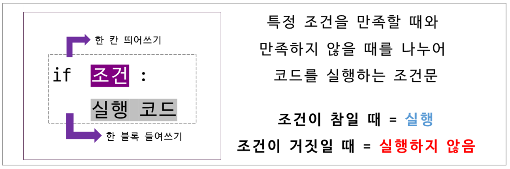
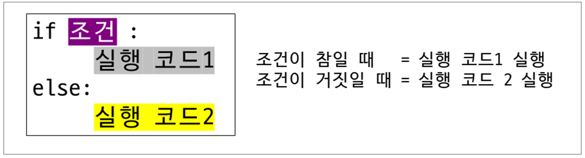
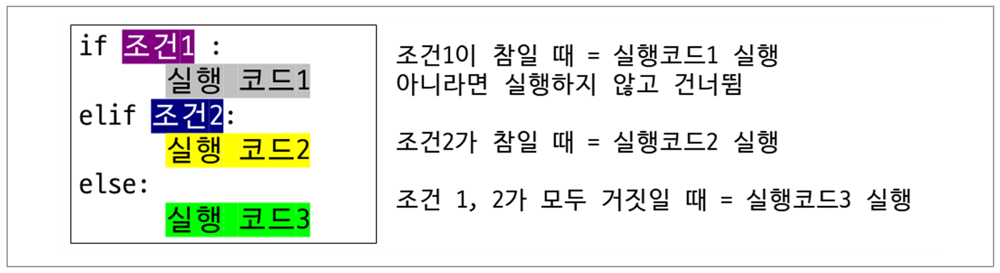

>## **if**

<br/>

파이썬 프로그램은 한 줄씩 차례대로 실행됩니다.  
하지만 작업을 하다 보면 특정 조건에만 코드가 실행되게 해야 하는 경우가 생깁니다.  
조건문을 사용하면 특정 조건에 따라 다른 코드를 실행할 수 있습니다.  

<br/>


### **1. if**  

주어진 조건이 참이면 실행하고, 거짓일 경우 실행하지 않습니다.
<br/>

  
<br/>

if를 작성하고, 바로 옆에 참(True) 또는 거짓(False)을 판단할 수 있는 조건을 작성하고 :을 적습니다.  
다음 줄에 조건이 참일 때 실행할 코드를 작성합니다.  

<br/>


***정수를 입력받아서 음수이면 출력하는 예제***  
<br/>

```python
num = int(input('정수: '))

if num<0:
    print(num)
    print('음수입니다.')
```  

```
정수: -1
-1
음수입니다.
```  

<br/><br/>


### **2. if ~ else**  

if와 else가 함께 있는 형태입니다.  
if의 조건이 참이면 if 안의 코드를 실행하고,  
거짓일 경우 else의 코드를 실행합니다.  

<br/>

  
<br/>

if를 작성하고, 바로 옆에 참(True) 또는 거짓(False)을 판단할 수 있는 조건을 작성하고 :을 적습니다.  
다음 줄에 else를 작성하고 :을 적습니다.  

<br/>

***점수를 입력받아서 80점 이상이면 합격을 출력하고,***     
***아니면 불합격을 출력하는 예제***  
<br/>

```python
score = int(input('점수: '))

if score>=80:
    print('합격입니다.')
else:
    print('불합격입니다.')
```  


```
점수: 90
합격입니다.
```  

<br/>


***입력받은 숫자가 홀수인지 짝수인지 판단하는 예제***  

```python
num = int(input('숫자 하나 입력: '))

if num%2==0:
    print('{}은(는) 짝수입니다.'.format(num))
else:
    print('{}은(는) 홀수입니다.'.format(num))
```  

```
숫자 하나 입력: 2
2은(는) 짝수입니다
```  

<br/><br/>


### **3. if ~ elif ~ else**  
<br/>

조건이 여러 개일 때 if ~ elif ~ else를 사용합니다.  
if의 조건이 참이면 if 안의 코드를 실행하고,  
거짓일 경우 elif의 조건을 판단합니다.  
elif 의 조건이 참이면 elif의 코드를 실행하고  
거짓이면 else의 코드를 실행합니다.  

<br/>

  
<br/>

***0~100점 사이의 점수를 입력받아서 성적을 출력하는 예제***  

>점수가 90점 이상 A,  
80점 이상 90점 미만 B,  
70점 이상 80점 미만 C,  
60점 이상 70점 미만 D,  
0점 이상 60점 미만은 F입니다.  

>0~100점 사이의 점수를 입력받아서  
성적을 출력하세요.  

```python
score = int(input('점수를 입력하세요(0~100): '))

if 90 <= score <=100:
    print('A')
elif 80 <= score <90:
    print('B')
elif 70 <= score <80:
    print('C')
elif 60 <= score <70:
    print('D')    
elif 0 <= score <60:
    print('F')
else:
    print('점수의 범위는 0~100점입니다.')
```  


```
점수를 입력하세요(0~100): 98
A
```  

<br/>


***세 수를 입력받아서 가장 큰 수 출력***  

```python
a,b,c = map(int, input().split())

if a>b:
    mx = a
else:
    mx = b

if c>mx:
    mx = c

print(mx)
```  

```
1 2 3
3
```  

<br/>


***윤년, 평년 구하기***  

>4로 나누어 떨어지고 100으로 나누어 떨어지지 않으면 윤년이다.  
400으로 나누어 떨어지면 윤년이다.  
나머지는 모두 평년이다.  

<br/>

```python
year = int(input('year: '))

if year%4==0 and year%100!=0:
    print('윤년')
elif year%400==0:
    print('윤년')
else:
    print('평년')
```  

```
year: 2000
윤년
```  

<br/>
