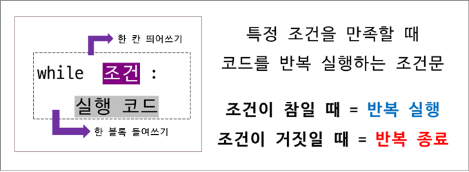
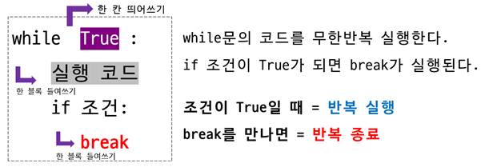
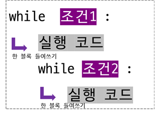

>## **while**

<br/>

### **1. while**  
<br/>

주어진 조건이 참이면 코드를 반복해서 실행하고, 거짓일 경우 반복을 멈추게 됩니다.
<br/>



<br/>

while을 작성하고, 바로 옆에 참(True) 또는 거짓(False)을 판단할 수 있는 조건을 작성하고 :을 적습니다.  

다음 줄에 조건이 참일 때 반복적으로 실행할 코드를 작성합니다.

<br/><br/>

다음 예제는 hello world를 5번 출력하는 예제입니다.
<br>

```python
i = 1

while i<=5:
    print('hello world')
    i = i+1
```  

```
hello world
hello world
hello world
hello world
hello world
```   
</br>


1부터 10까지 출력하는 예제입니다.
<br/>


```python
i = 1

while i<=10:
    print(i, end=' ')
    i = i+1
```  

```
1 2 3 4 5 6 7 8 9 10 
```

<br/><br/>


### **2. 무한 반복하기**  
<br/>

while 옆에 True를 적으면 무한 반복을 만들 수 있습니다.  
while의 조건이 항상 참이 되기 때문에 계속 반복하게 됩니다.  
무한 반복을 멈추기 위해서는 break를 사용해서 반복문에서 빠져나갑니다.  

<br/>




<br>

i를 1씩 증가하면서 출력하는 작업을 무한 반복하다가  
i가 10이 되면 반복을 빠져나오는 예입니다.   

<br/>


```python
i = 1

while True:
    print(i, end=' ')

    if i == 10:
        break
    
    i = i+1
```  

```
1 2 3 4 5 6 7 8 9 10
```

<br/><br/>


### **3. 중첩 while**  
<br/>

while 문 안에 다시 while 문이 들어올 수 있습니다.
<br/>



<br/>

중첩된 while문을 사용해서 구구단을 출력하는 예입니다. 
<br/>


```python
i = 2

while i<=9:
    j = 1

    while j<=9:
        print('{}'.format(i*j), end=' ')
        j = j+1
    i = i+1

    print()
```  

```
2 4 6 8 10 12 14 16 18 
3 6 9 12 15 18 21 24 27 
4 8 12 16 20 24 28 32 36
5 10 15 20 25 30 35 40 45
6 12 18 24 30 36 42 48 54
7 14 21 28 35 42 49 56 63
8 16 24 32 40 48 56 64 72
9 18 27 36 45 54 63 72 81
```


<br/><br/>  


### **4. while 반복문의 기본 예제**  
<br/>

*** 4.1 짝수 출력하기 ***
<br/>

```python
i = 1

while i<=20:
    if i%2 == 0:
        print(i, end=' ')
    i = i+1
```  

```
2 4 6 8 10 12 14 16 18 20
```

<br/>  


*** 4.2 합계 구하기 ***
<br/>

```python
s = 0
i = 1

while i<=5:
    s = s+i
    i = i+1

print('합계:', s)
```  

```
합계: 15
```

<br/>

*** 4.3 입력받은 n까지 출력하기 ***
<br/>


```python
n = int(input('n: '))

i=1

while i<=n:
    print(i)
    i = i+1
```  

```
n: 5
1
2
3
4
5
```

<br/>  


***4.4. 입력받은 조건이 맞으면 반복하기*** 
<br/>


yes를 입력하면 반복하고 다른 데이터를 입력하면 반복을 멈추는 예제  
<br/>

```python
text = 'yes'

while text == 'yes':
    text = input('yes 입력시 반복: ')

print('종료')
```  

```
yes 입력시 반복: yes
yes 입력시 반복: no
종료
```  

<br/>


e 또는 E가 입력될 때까지 반복하는 예제입니다.
<br/>


```python
text = input('e또는 E입력 시 종료: ')

while text!='e' and text!='E':
    text = input('e 또는 E 입력 시 종료: ')

print('종료')
```  

```
e또는 E입력 시 종료: 100
e 또는 E 입력 시 종료: 1.23
e 또는 E 입력 시 종료: 안녕하세요
e 또는 E 입력 시 종료: e
종료
```  

<br/><br/>


***4.5 리스트에 적용*** 
<br/>

리스트에 있는 데이터를 while 문을 사용해서 출력하는 예제입니다.
<br/>

```python
alist = [100, 200, 300, 400, 500]

i = 0

while i<len(alist):
    print(alist[i], end=' ')
    i = i+1
```  

```
100 200 300 400 500 
```  

<br/><br/>


***4.6 str(문자열)에 적용*** 
<br/>

문자열을 while 문을 사용해서 출력하는 예제입니다.
<br/>

```python
word = 'hello'

i = 0

while i<len(word):
    print(word[i])
    i = i+1
```  

```
h
e
l
l
o
```  

<br/>
