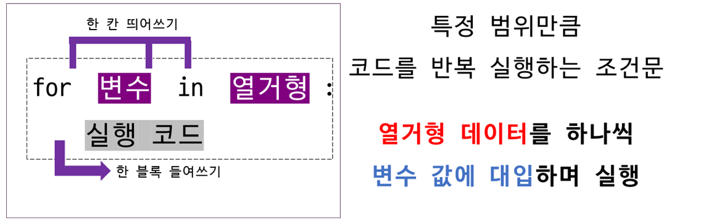
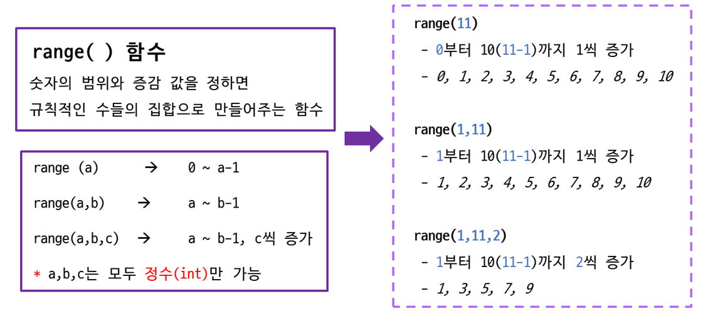
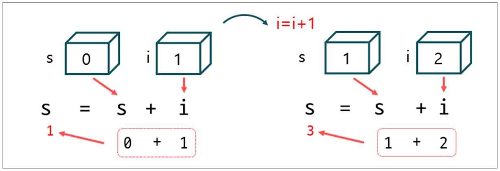

>## **for**

<br/>

### **1. for**  
<br/>

for 반복문은 그림과 같이 for 키워드 옆에 변수를 작성하고, 다음에는 in 키워드를 작성합니다.  
그리고 옆에는 문자열, 리스트, 튜플, 집합, 딕셔너리와 같은 컨테이너 자료형 또는 range(), enumerate()와 같은 iterable 객체를 반환하는 함수를 작성합니다.  
iterable 데이터의 개수만큼 반복하면서, 원소를 하나씩 꺼내서 변수에 넣습니다.

<br/>


<br/>
<br/>

**ange() 함수가 iterable 객체를 반환하는 함수의 예**
<br/>


<br/><br/>


***1에서 5까지를 출력하는 예제입니다.***  
<br>

```python
for i in range(1, 6, 1):   # 1에서 5까지 1씩 증가 
    print(i, end=' ')
``` 

```
1 2 3 4 5 
```   
<br/><br/>


### **2. range() 연습**  
<br/>


range() 함수의 예입니다.  
range() 함수의 결과는 <class 'range'> 타입입니다.  
결과에 list를 적용하면 데이터를 확인할 수 있습니다.  

<br/>

```python
num = range(1, 11, 1)
print(num, type(num))
``` 

``` 
range(1, 11) <class 'range'>
```   
<br/>

range() 결과에 list 적용하기.
<br/>

```python
print(list(range(5)))            
print(list(range(1, 11)))        
print(list(range(3, 10, 3)))      
print(list(range(5, 0, -1)))      
print(list(range(10, -11, -5))) 
``` 

``` 
[0, 1, 2, 3, 4]
[1, 2, 3, 4, 5, 6, 7, 8, 9, 10]
[3, 6, 9]
[5, 4, 3, 2, 1]
[10, 5, 0, -5, -10]
```   
<br/>


### **3. for() 연습**  
<br/>

1에서 10까지 합계를 구하는 예입니다.

<br/>

```python
s = 0

for i in range(1, 11, 1):
    s = s + i

print('합계: ', s)
``` 

``` 
합계:  55
```   
<br/>

변수 s를 0으로 초기화 합니다.  
10번 반복을 하면서 변수 s의 값과 변수 I의 값을 더해서 다시 변수 s에 누적합니다.  


<br/><br/>


1에서 100까지 짝수의 합계를 구하는 예입니다.
<br/>

```python
s = 0

for i in range(1, 101, 1):
    if i%2==0:
        s = s + i

print('짝수의 합계: ', s)
``` 

``` 
짝수의 합계: 2550
```   
<br/>


자연수를 입력받아서 1에서 입력받은 숫자까지 출력하는 예입니다.
<br/>

```python
n = int(input('숫자 입력: '))

for i in range(1, n+1, 1):
    print(i, end=' ')
``` 

``` 
숫자 입력: 10
1 2 3 4 5 6 7 8 9 10 
```   
<br/>


2개의 자연수를 입력받아서 첫 번째 입력받은 숫자에서 두 번째 입력받은 숫자까지 출력하는 예입니다.  
<br/>

```python
a, b = input('숫자 2개 입력: ').split()
a = int(a)
b = int(b)

if a>b:
    a, b = b, a

for i in range(a, b+1, 1):
    print(i, end=' ')
``` 

``` 
숫자 2개 입력: 1 10
1 2 3 4 5 6 7 8 9 10 
```   
<br/><br/>


### **4. 이중 for()**  
<br/>

for() 반복문 안에 또 다른 for() 문을 넣어서 사용할 수 있습니다.
<br>

2단에서 5까지 구구단을 출력하기
<br>

```
for i in range(2, 6, 1):
    for j in range(1, 10, 1):
        print('{}*{}={} '.format(i, j, i*j), end=' ' )

    print()
```  

```
2*1=2  2*2=4  2*3=6  2*4=8  2*5=10  2*6=12  2*7=14  2*8=16  2*9=18  
3*1=3  3*2=6  3*3=9  3*4=12  3*5=15  3*6=18  3*7=21  3*8=24  3*9=27  
4*1=4  4*2=8  4*3=12  4*4=16  4*5=20  4*6=24  4*7=28  4*8=32  4*9=36
5*1=5  5*2=10  5*3=15  5*4=20  5*5=25  5*6=30  5*7=35  5*8=40  5*9=45
```  

<br/><br/>

### **5. 문자열, 리스트에 for 반복문 사용하기**  
<br/>

str(문자열)에 for() 반복문을 적용한 예입니다.  
<br/>

문자열의 길이만큼 'hello'에 대해서 반복을 수행합니다.
<br/>

```python
word = 'hello'

for i in range(0, len(word), 1):
    print(word[i])
```  

```
h
e
l
l
o
```  
<br/>

```python
word = 'hello'

for i in word:
    print(i)
```  

```
h
e
l
l
o
```  
<br/>

list(리스트)에 for() 반복문을 적용한 예입니다.
<br/>

```python
num = [10, 20, 30, 40, 50]

for i in range(0, len(num), 1):
    print(num[i])
```  

```
10
20
30
40
50
```  
<br/>

```python
num = [10, 20, 30, 40, 50]

for i in num:
    print(i)
```  

```
10
20
30
40
50
```  
<br/><br/>


### **6. set(집합)에 for 반복문 사용하기**  
<br/>

set은 인덱스 개념이 없습니다.  
따라서 for() 반복문에 range() 함수를 사용할 수 없습니다.
<br/>


```python
aSet = {'orange', 'banana', 'apple'}

for i in aSet:
    print(i)
```  

```
banana
apple
orange
```

<br/><br/>


### **7. dict(딕셔너리)에 for 반복문 사용하기**  
<br/>

딕셔너리의 키와 값을 모두 출력합니다.
<br/>

```python
aDict = {'name':'홍길동', 'age':20, 'address':'Seoul'}

for key, value in aDict.items():
    print(key, ':', value)
```  

```
name : 홍길동
age : 20
address : Seoul
```

<br/>
