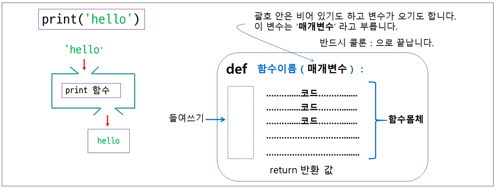
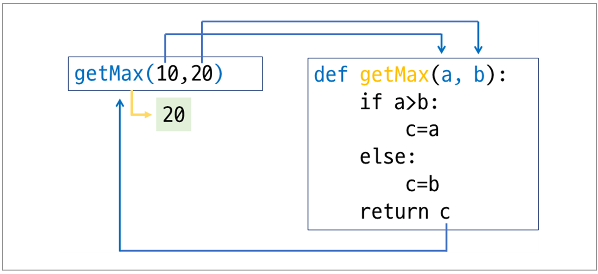

>## **1 함수란?**

<br/>

함수는 특정한 기능을 하기 위해서 작성된 코드입니다.  
이렇게 작성된 함수는 필요할 때마다 함수를 불러서 사용할 수 있습니다.  
파이썬에서는 다양한 함수를 미리 만들어서 제공합니다.  
이런 함수들을 내장함수라고 합니다.  
그리고 필요한 함수를 만들어 쓸 수도 있는데 이렇게 우리가 만든 함수를 사용자 정의 함수라고 합니다.  


<br/>


>## **2 함수 작성 및 호출하기**

<br/>
 


함수를 정의한다는 것은 함수에 이름을 붙이고 특정 기능을 하는 코드를 작성하는 것입니다.
<br/>

그림과 같이 def 키워드로 시작하고 함수 이름을 적습니다.  
함수 이름 옆에는 괄호()와 콜론을 적습니다.  
괄호 안에는 매개변수가 올 수 있습니다.  
<br/>

함수의 몸체 부분은 들여쓰기로 시작해서 코드를 작성합니다.  
함수에서 반환 값이 있을 경우 return을 통해서 결과를 반환하고,  
없을 경우 return을 적지 않아도 됩니다.  

<br/>


<br/>


2개의 숫자를 매개변수로 받아서 둘 중 더 큰 수를 리턴 해주는 함수입니다.  
<br/>


<br/><br/>


>## **3 함수의 매개변수와 인자**

<br/>

### **3.1 인자값도 없고 리턴 값도 없는 경우**  
<br/>

함수의 괄호가 비어있습니다. 따라서 함수를 호출할 때 인자가 없습니다.  
그리고 함수 몸체에 return이 없기 때문에 리턴 값도 없는 함수입니다.  
return은 함수를 끝내고 함수를 호출한 자리로 돌아가라는 의미입니다.    

<br/>

인자와 리턴 값이 없는 함수  

```python
def func():
    print('hello sonol')

func()
```

```
hello python
```  

<br/>


### **3.2 인자는 있고 리턴 값은 없는 경우**  
<br/>

함수의 괄호안에 인자를 넣어서 호출합니다.  
그리고 함수 몸체에는 return이 없습니다.  
따라서 인자는 있고, 리턴 값은 없는 함수입니다.
<br/>


인자는 있고 리턴 값은 없는 함수 

```python
def func(x):
    print('x:', x)
    
a = 10
func(a)
```

```
x: 10
```  

<br/>


### **3.3 인자와 리턴 값이 모두 있는 경우**  
<br/>

함수를 호출할 때 2개의 인자를 넣어서 호출합니다.  
그리고 함수의 몸체에서는 매개변수로 넘어온 데이터를 더한 결과를 리턴해줍니다.   따라서 인자와 리턴이 모두 있는 함수입니다.   
<br/>


인자와 리턴 값이 모두 있는 함수  

```python
def add(x, y):
    return x+y

a = 10
b = 20
c = add(a, b)

print('합계:', c)
```

```
합계: 30
```  

<br/>


>## **4 함수의 리턴 값**

<br/>

함수의 리턴 값이 1개 또는 여러 개일 수가 있습니다.  

<br/>


### **4.1 리턴 값이 1개인 경우**  
<br/>


```python
def sumList(li):
    s = 0
    
    for i in li:
        s = s + i

    return s

aList = [20, 30, 40, 50, 10]
result = sumList(aList)
print('결과:', result)
```

```
결과: 150
``` 

<br/>

### **4.2 리턴 값이 여러 개인 경우**  
<br/>


매개변수로 리스트를 받은 뒤 합계와 평균을를 계산해서 리턴 해주는 함수입니다.  

```python
def sumList(li):
    return sum(li), sum(li)/len(li)

aList = [20, 30, 40, 50, 10]
res1, res2 = sumList(aList)

print('합계:', res1)
print('평균:', res2)
```

```
합계: 150
평균: 30.0
``` 

<br/>


>## **4 지역변수와 전역변수**

<br/>

### **지역변수**  
<br/>

함수 안에서 만든 변수.  
해당 함수가 실행되는 동안에만 존재하며 실행이 끝나면 없어진다.  
<br/><br/>

### **전역변수**  
<br/>

프로그램 어디에서나 사용할 수 있다.  

<br/><br/>


### 지역변수  

```python
def func():
    a = 10      # 지역변수
    print(a)

# main
print('여기서 시작')
func()
print(a)    # a는 지역변수. 에러발생
```  

```
여기서 시작
10

print(a)    # a는 지역변수. 에러발생
NameError: name 'a' is not defined
```  

<br/><br/>


### 전역변수  

```python
def func():
    a = 10      # 지역변수
    print('a', a)
    print('x', x)    # 전역변수 x 사용가능

# main
print('여기서 시작')
x = 10      # 전역변수. 어디에서나 사용가능
print('x', x)
func()
```  

```
x 10
a 10
x 10
``` 
<br/><br/>


### **지역변수와 전역변수의 이름이 같은 경우**  
<br/>

지역변수가 전역변수 보다 우선순위가 높다.
<br/>

```python
def func():
    a = 10                 # 지역변수
    print('func() ', a)    # 지역변수 출력      
    

# main
print('여기서 시작')
a = 20      # 전역변수
func()
print('main ', a)
```  

```
여기서 시작
func()  10
main  20
``` 
<br/><br/>


### **지역변수에서 전역변수를 사용하는 경우**  
<br/>

```python
def func():
    global a    
    print('func() ', a)    # 전역변수 출력      
    a = 10  # 전역변수의 값을 변경

# main
print('여기서 시작')
a = 20      # 전역변수
func()
print('main ', a)

```  

```
여기서 시작
func()  20
main  10
``` 
<br/><br/>


>## **5 매개변수와 입력인자의 다양한 형태**

<br/>

### **기본값이 있는 매개변수 1**  
<br/>

함수를 정의할 때 매개변수에 기본값을 줄 수있습니다.  
함수를 호출하면 매개변수가 입력 인자를 받아서 함수를 실행하는데  
만약에 매개변수가 기본값을 가지고 있으면 그 변수에는 인자를 넘기지 않습니다.  
<br/>


인자를 3개 모두 넘긴다  

```python
def func(width, length, height=10):
    print('width:  %d' %(width))    # 2
    print('length: %d' %(length))   # 3
    print('height: %d' %(height))   # 5
    
    return width * length * height

print(func(2, 3, 5))
```  

```
width:  2
length: 3
height: 5
30
``` 
<br/><br/>


인자를 2개만 넘긴다.  

```python
def func(width, length, height=10):
    print('width:  %d' %(width))    # 2
    print('length: %d' %(length))   # 3
    print('height: %d' %(height))   # 10 기본
    
    return width * length * height

print(func(2, 3))
```  

```
width:  2
length: 3
height: 10
60
``` 
<br/><br/>


### **기본값이 있는 매개변수 2**  
<br/>

**기본값이 2개인 경우**  
<br/>


```python
def func(width, length=5, height=10):
    print('width:  %d' %(width))    # 1
    print('length: %d' %(length))   # 5  기본
    print('height: %d' %(height))   # 10 기본
    
    return width * length * height

print(func(1))
```  

```
width:  1
length: 5
height: 10
50
``` 
<br/><br/>


### **기본값이 있는 매개변수 3**  
<br/>

**기본값이 3개인 경우**  
<br/>

```python
def func(width=8, length=5, height=10):
    print('width:  %d' %(width))    # 8  기본
    print('length: %d' %(length))   # 5  기본
    print('height: %d' %(height))   # 10 기본
    
    return width * length * height

print(func())
```  

```
width:  8
length: 5
height: 10
400
``` 
<br/><br/>


```python
def func(width=8, length=5, height=10):
    print('width:  %d' %(width))    # 1
    print('length: %d' %(length))   # 5  기본
    print('height: %d' %(height))   # 10 기본
    
    return width * length * height

print(func(1))

```  

```
width:  1
length: 5
height: 10
50
``` 
<br/><br/>


```python
def func(width=8, length=5, height=10):
    print('width:  %d' %(width))    # 1
    print('length: %d' %(length))   # 2  
    print('height: %d' %(height))   # 10 기본
    
    return width * length * height

print(func(1, 2))

```  

```
width:  1
length: 2
height: 10
20
``` 
<br/><br/>

```python
def func(width=8, length=5, height=10):
    print('width:  %d' %(width))    # 1
    print('length: %d' %(length))   # 2  
    print('height: %d' %(height))   # 10 기본
    
    return width * length * height

print(func(1, 2, 3))
```  

```
width:  1
length: 2
height: 3
6
``` 
<br/><br/>


### **가변개수의 인수를 받을수 있는 매개변수(*args)**  
<br/>


하나의 매개변수에 여러 개의 인자를 넣을 수 있습니다.  
가변 개수의 인자를 받는 매개변수 입니다.  
이런 매개변수는 함수를 정의할 때 * 기호를 붙여서 구별합니다.  
<br/>  

```python
def func(*args):
    print(args)
    
# 결과는 튜플입니다
func()             # ()
func(10)           # (10,)
func(10, 20)       # (10, 20)
func(10, 20, 30)   # (10, 20, 30)
```  

```
()
(10,)
(10, 20)
(10, 20, 30)
``` 
<br/><br/>


```python
def func(n, *args):
    print(args)
    
# 첫 번째 인자가 n으로 넘어간다.
func(10)           # ()
func(10, 20)       # (20,)
func(10, 20, 30)   # (20, 30)
```  

```
()
(20,)
(20, 30)
``` 
<br/><br/>
