>## **1 모듈**

<br/>

모듈은 서로 관련 있는 프로그램 코드들을 묶어 놓은 파일입니다.  
모듈 안에는 함수나 변수 또는 클래스들이 들어갈 수 있으며 확장자는 py 입니다.  
모듈은 이미 만들어 놓은 모듈을 사용할 수도 있고, 직접 만들어서 사용할 수도 있습니다.  
모듈은 파이썬에 기본적으로 제공하는 표준 모듈과 사용자가 직접 만든 사용자 정의 모듈로 나눌 수 있습니다.  
<br/><br/>


>## **2 모듈 사용방법**

<br/>

모듈을 사용하기 위해서는 모듈을 가져와야 합니다.  
모듈을 가지고 오는 방법은 다음과 같습니다.  
<br/><br/>


### **2.1 모듈의 모든 속성을 가져오기**  
<br/>

특정 모듈의 모든 속성을 가져다 사용할 때는 다음과 같이 사용합니다.
<br/>

> # **import 모듈 이름**
<br/><br/>

예를 들어 math 모듈을 가져와서 사용한다면 다음과 같이 작성합니다.  
<br/>

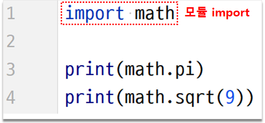
<br/>


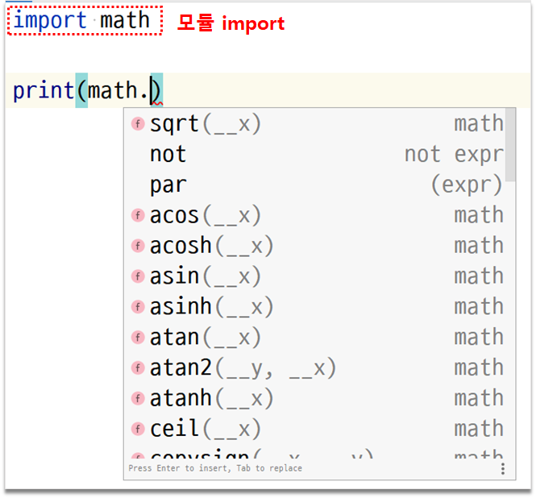
<br/>


```python
import math

print(math.pi)
print(math.sqrt(9))
```

```
3.141592653589793
3.0
```  
<br/>


### **2.2 모듈의 필요한 부분만 가져오기**  
<br/>

> # **from 모듈 이름 import 클래스 이름/함수 이름**
<br/><br/>


math 모듈에서 pow() 함수만 사용하고자 한다면 다음과 같이 작성합니다.  
<br/>


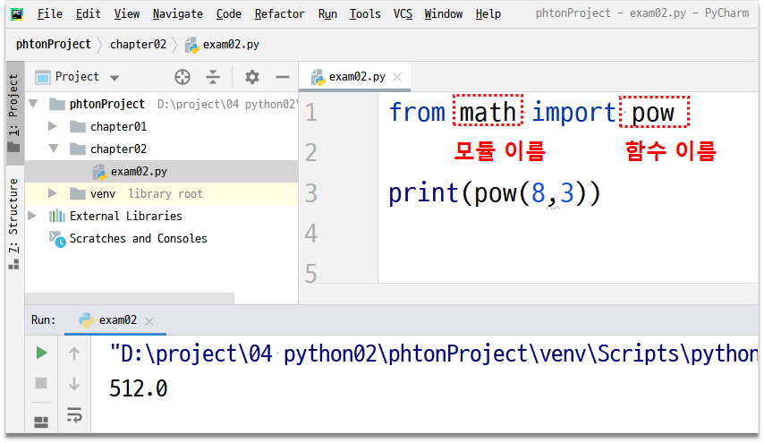
<br/>


```python
from math import pow

print(pow(8, 3))
```

```
512.0
```  
<br/><br/>

person 클래스  

```python
class Person:
    def __init__(self):
        self.name  = '홍길동'

    def getName(self):
        return self.name
```

<br/>

클래스로 만들어진 person 모듈 사용  

```python
from libs.math.person import Person

p1 = Person()
person_name = p1.getName()
print(person_name)
```

```
홍길동
```  
<br/>


### **2.3 모듈에 별명을 붙여 사용하기**  
<br/>

모듈의 이름이 길거나 다른 이름으로 붙여서 사용하고자 할 때  
모듈에 alias를 붙여 사용할 수 있습니다.  
<br/>

> # **import 모듈 이름 as alias**
<br/><br/>

다음과 같이 math 모듈을 ms 라는 이름으로 사용할 수 있습니다.
<br/>

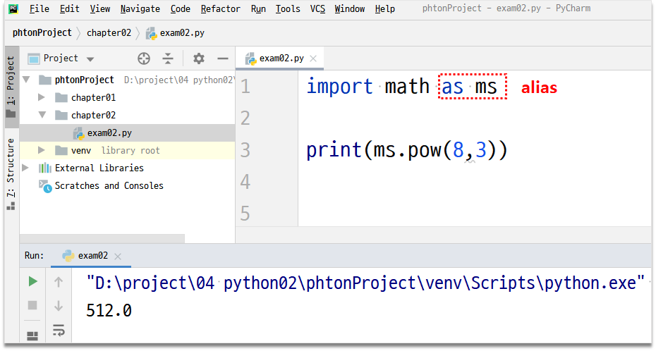
<br>


```python
import math as ms

print(ms.pow(8, 3))
```

```
512.0
```  
<br/><br/>


>## **3 모듈 만들어 사용하기**

<br/>

모듈을 직접 만들어서 사용하는 방법을 알아보겠습니다.  
함수나 클래스를 직접 작성해서 하나의 파이썬 파일에 모아두면 모듈이 완성됩니다.  
그리고 import 구문을 사용해서 가져다 쓰면 됩니다.  
<br/>


1. 라이브러리를 모아두기 위한 디렉터리를 만들겠습니다.
<br/>

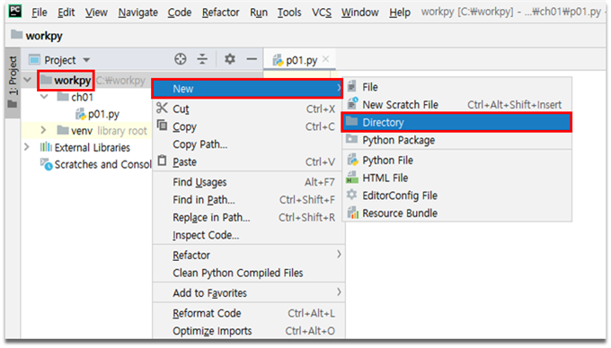
<br/>

디렉터리 이름을 libs 라고 입력합니다.  
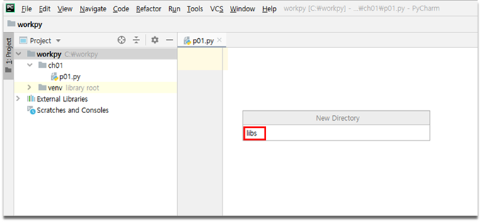
<br/>


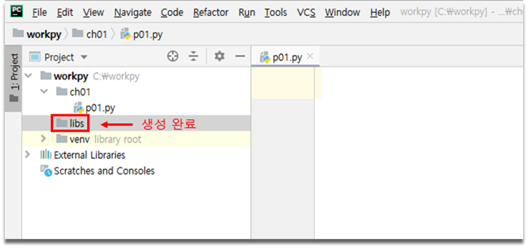
<br/><br/>


2. 패키지 만들기
<br/>


libs 디렉터리 아래에 역할별로 패키지를 만들겠습니다.  
예를 들어 수학에 관련된 것을 모으고 싶으면 math라는 이름의 패키지를 만들어서 관리합니다.  

<br/>

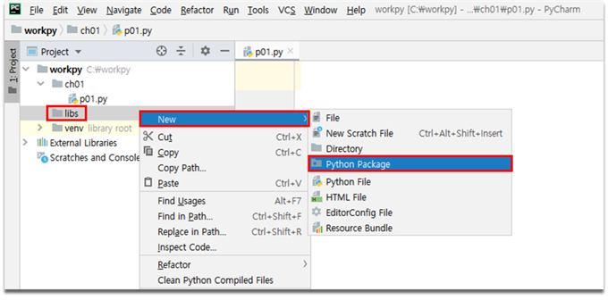
<br/>

패키지 이름에 math를 입력합니다.  

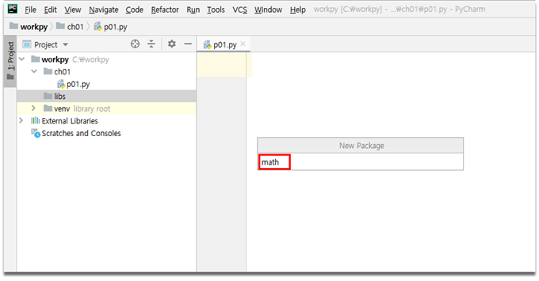
<br/>

다음과 같이 math 패키지가 생성되었습니다.  

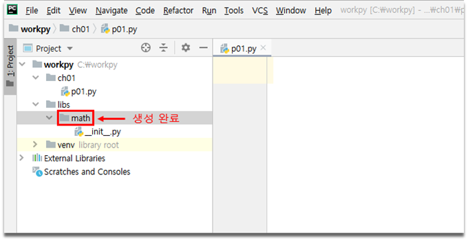
<br/><br/>


3. 패키지 안에 모듈에 관련된 파일 만들기  
<br/>

함수들을 모아 놓을 파일을 만들겠습니다.  
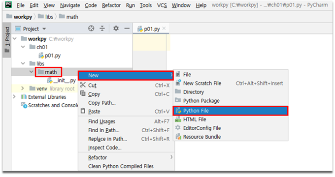
<br/>

파일 이름은 calc 로 입력합니다.    
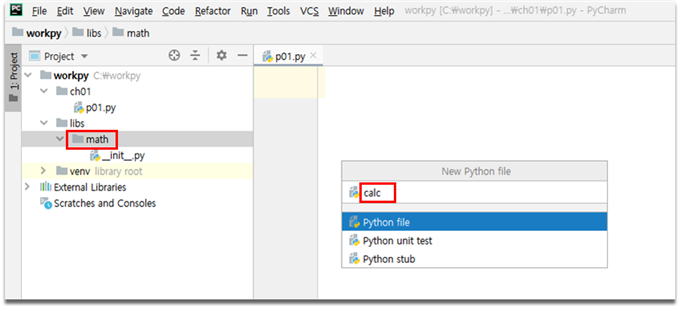
<br/>  

calc.py 가 생성되었습니다.  
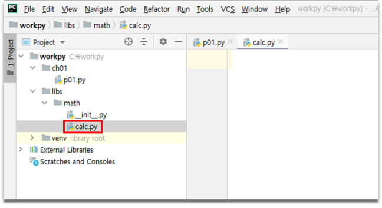
<br/>

calc.py 에 사칙연산을 하는 함수를 작성합니다.  
두 개의 수를 매개변수로 받아서 덧셈, 뺄셈, 곱셈, 나눗셈의 결과를 리턴 하는 함수입니다.  

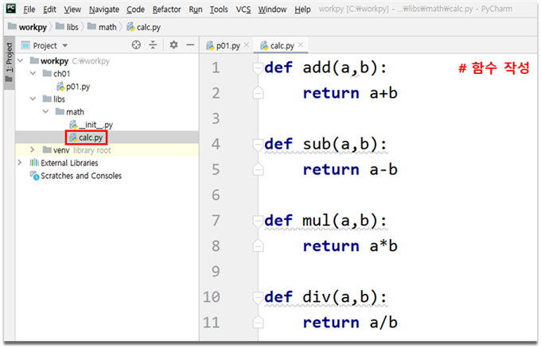
<br/><br/>

```python
def add(a,b):      
    return a+b

def sub(a,b):       
    return a-b

def mul(a,b):       
    return a*b

def div(a,b):
    return a/b
```

<br/><br/>


4. 작성한 모듈 사용하기  
<br/>

p01.py 파일에서 우리가 만든 모듈을 가져와서 사용해보겠습니다.  
<br/>

모듈이 있는 경로와 사용할 함수를 작성합니다.  
add 함수만 import 했습니다.  
<br/>

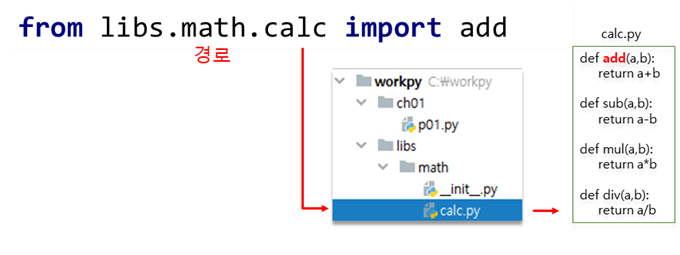
<br/>

add 함수에 인자로 5와 7을 넣어서 결과를 result에 리턴 받고 print 함수를 통해서 출력합니다.  

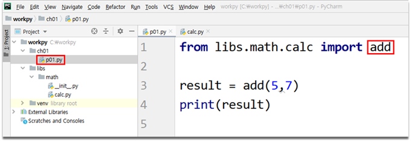
<br/>

p01.py 파일을 실행합니다.  

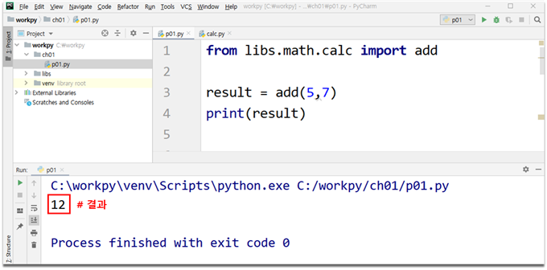
<br/><br/>

```python
from libs.math.calc import add

result = add(5,7)
print(result)
```
<br/><br/>


import 뒤에 *을 붙이면 함수 이름을 지정하지 않고 calc.py 에 있는 함수를 바로 사용 가능합니다.  
<br/>

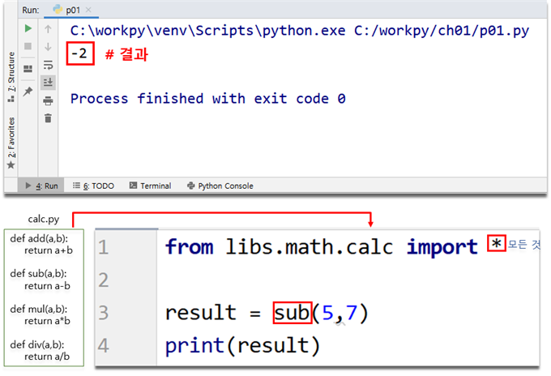
<br/><br/>

```python
from libs.math.calc import sub

result = sub(5,7)
print(result)
```
<br/><br/>


>## **4 성적 모듈 만들기 실습**

<br/>

math 패키지에 마우스 오른쪽 버튼 클릭 New → Python File을 클릭합니다.  

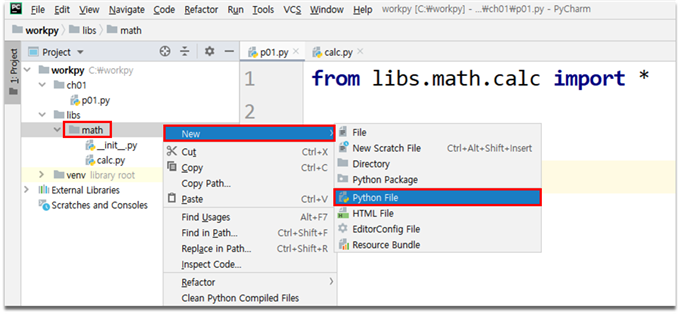
<br/>

파일 이름에 sj 를 입력합니다.  

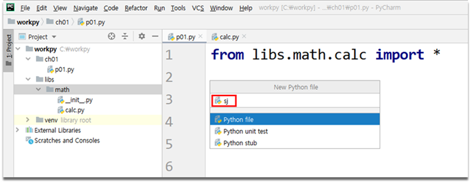
<br/><br/>

sj.py 에 성적에 관련된 함수를 작성하겠습니다.  
total 함수는 합계를 구하는 함수입니다. 매개변수 a는 리스트 또는 튜플의 자료형으로 들어옵니다.  
avg 함수는 평균을 구하는 함수입니다. 매개변수 a는 리스트 또는 튜플의 자료형으로 들어옵니다.  

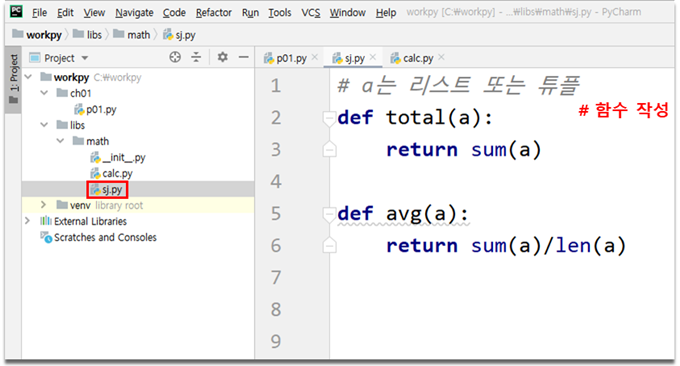
<br/>

p01.py 파일에서 sj.py를 가져와서 사용해보겠습니다.  

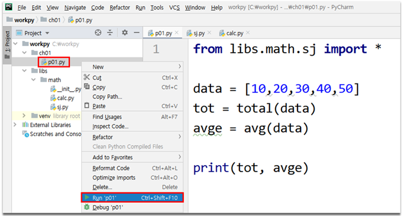
<br/>

실행결과입니다.  

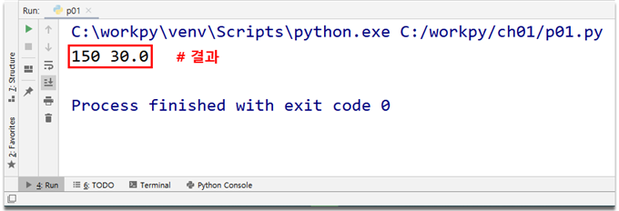
<br/>


```python
# a는 리스트 또는 튜플
def total(a):
    return sum(a)

def avg(a):
    return sum(a)/len(a)
```

<br/>

```python
from libs.math.sj import *

data = [10,20,30,40,50]
tot = total(data)
avge = avg(data)

print(tot, avge)
```

<br/>
