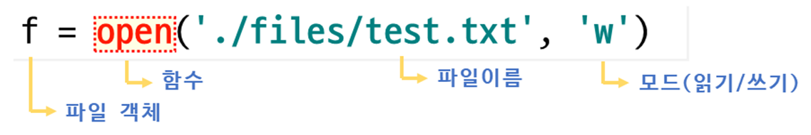
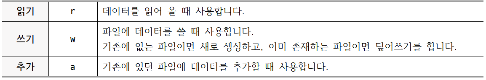
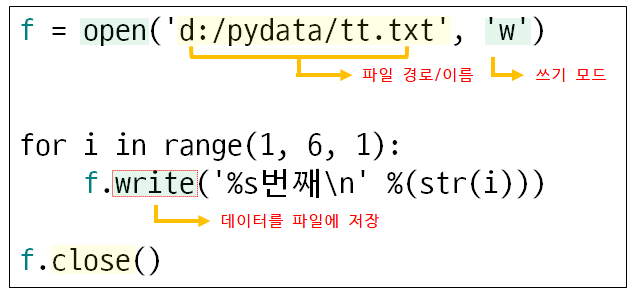
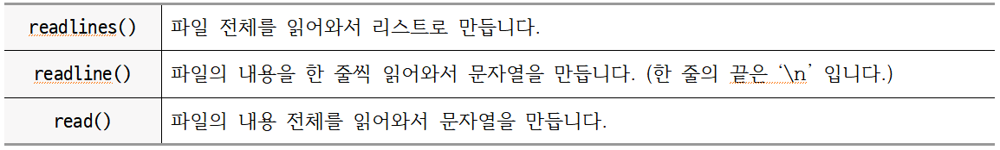

## **01 파일 열기 (open)**  

<br/>

파일을 생성해서 데이터를 쓰거나, 생성된 파일에서 데이터를 읽어오기 위해서는 파일을 open 해야 합니다.  
파일 open이 되면 파일 객체가 생성되고 파일 객체를 통해서 파일에 데이터를 쓰거나 읽어 올 수 있습니다.  
<br/>


<br/><br/>


**파일 모드**  


<br/><br/>

<br/>


## **02 파일에 데이터를 쓰기**  

<br/>

<br/>


>## **write()**  
<br/>

```python
f = open('d:/pydata/tt.txt', 'w')   # 파일을 쓰기모드로 open

for i in range(1, 6, 1):
    f.write('%s번째\n' %(str(i)))    # 파일에 출력

f.close()   # 파일을 닫는다
```  
 
<br/><br/>


***파일이름과 점수를 입력받아서 파일로 만들기***


```python
file_name = input('파일 이름: ')

f = open('d:/pydata/' + file_name + '.txt', 'w')

for i in range(0, 5, 1):
    score = input('점수 : ')  # str로 입력
    f.write(score)
    f.write('\n')

f.close()
```  

```
파일 이름: eng
점수 : 97
점수 : 98
점수 : 55
점수 : 98
점수 : 10

Process finished with exit code 0

```  
<br/><br/>


***파일 복사하기***
```python
read = open('d:/pydata/data.txt', 'r')
copy = open('d:/pydata/data_copy.txt', 'w')

for line in read:
    copy.write(line)

read.close()
copy.close()
```  
  
<br/><br/>


>## **writelines()**  
<br/>

writelines 메소드는 문자열로 구성된 리스트를 만들어서 파일에 저정합니다.  
<br/>

```python
f = open('d:/pydata/data2.txt', 'w')

li = ['good morning\n', 'hello\n', 'hi\n', 'nice to meet you\n']
f.writelines(li)

f.close()
```  

<br/><br/>


## **03 파일에서 데이터를 읽어오기**  

<br/>


<br/><br/>


>## **read()**  
<br/>

파일의 내용을 문자열로 읽어오는 메소드 입니다.  


```python
f = open('d:/pydata/text.txt', 'r')   # 파일을 읽기모드로 open
contents = f.read()
print(contents)
f.close()
```  

```
Lorem Ipsum is simply dummy text of the printing and typesetting industry. Lorem Ipsum has been
```  
<br/><br/>


>## **read(인자)**  
<br/>

파일의 내용을 문자열로 읽어오는 메소드 입니다.  
정수를 인자로 넣어서 그 개수만큼의 문자를 읽어와서 반환.

```python
f = open('d:/pydata/text.txt', 'r') # 파일을 읽기모드로 open

# 10개의 문자를 읽어온다.
contents = f.read(10)   
print(contents)

f.close()
```  

```
Lorem Ipsu
```  
<br/><br/>


>## **readline()**  
<br/>

파일에서 한 줄씩 읽어오는 메소드 입니다.  
한 줄은 '\n'으로 판단합니다.  
읽어온 데이터는 문자열이 됩니다.  
<br/>

```python
f = open('d:/pydata/data.txt', 'r')

contents = f.readline()
print(contents)

contents = f.readline()
print(contents)


f.close()
```  

```
Lorem Ipsum is simply dummy text of the printing and typesetting industry. 

Lorem Ipsum has been the industry's standard dummy text ever since the 1500s, 
```  
<br/><br/>


>## **readline(인자)**  
<br/>

파일에서 한 줄씩 읽어오는 메소드 입니다.  
정수를 인자로 넣어서 그 개수만큼의 문자를 읽어와서 반환.  
한 줄은 '\n'으로 판단합니다.  
읽어온 데이터는 문자열이 됩니다.  
<br/>

```python
f = open('d:/pydata/data.txt', 'r')

contents = f.readline(5)
print(contents)

contents = f.readline(6)
print(contents)

f.close()
```  

```
Lorem
 Ipsum
```  
<br/><br/>


***while() 에 적용***  

```python
f = open('d:/pydata/data.txt', 'r')

line = f.readline()     # 한 줄 읽어온다

while line:
    print(line, end='') # 출력
    line = f.readline() # 한 줄 읽어온다

f.close()
```  

```
Lorem Ipsum has been the industry's standard dummy text ever since the 1500s, 
when an unknown printer took a galley of type and scrambled it to make a type specimen book. 
```  
<br/><br/>


***for 에 적용***  

```python
f = open('d:/pydata/data.txt', 'r')

for i in f:
    print(i.strip())    # 양쪽의 \n 을 제거

f.close()
```  

```
Lorem Ipsum has been the industry's standard dummy text ever since the 1500s, 
when an unknown printer took a galley of type and scrambled it to make a type specimen book.
```  
<br/><br/>


>## **readlines()**  
<br/>

파일 전체를 읽어와서 각 줄들로 구성된 리스트를 만듭니다. 
<br/>


```python
f = open('d:/pydata/data.txt', 'r')

li = f.readlines()
print(li)

f.close()
```  

```
['Lorem Ipsum is simply dummy text of the printing and typesetting industry. \n', "Lorem Ipsum has been the industry's standard dummy text ever since the 1500s, \n", 'when an unknown printer took a galley of type and scrambled it to make a type specimen book. \n', 'It has survived not only five centuries, but also the leap into electronic typesetting, \n', 'remaining essentially unchanged. \n', 'It was popularised in the 1960s with the release of Letraset sheets containing Lorem Ipsum passages, \n', 'and more recently with desktop publishing software like Aldus PageMaker including versions of Lorem Ipsum.']
```  
<br/><br/>


***for 에 적용하기***  


```python
f = open('d:/pydata/data.txt', 'r')

li = f.readlines()

for i in range(0, len(li), 1):
    print(li[i], end='')

f.close()
```  

```
Lorem Ipsum is simply dummy text of the printing and typesetting industry. 
Lorem Ipsum has been the industry's standard dummy text ever since the 1500s, 
when an unknown printer took a galley of type and scrambled it to make a type specimen book. 
```  
<br/><br/>

***점수를 읽어서 총점 평균 구하기***  

```python
f = open('d:/pydata/score.txt', 'r')

score = []

for i in f:
    score.append(int(i))

print('총점 : %d' %(sum(score)))
print('평균 : %.2f' %(sum(score)/len(score)))
```  

```
총점 : 461
평균 : 92.20
```  
<br/><br/>
